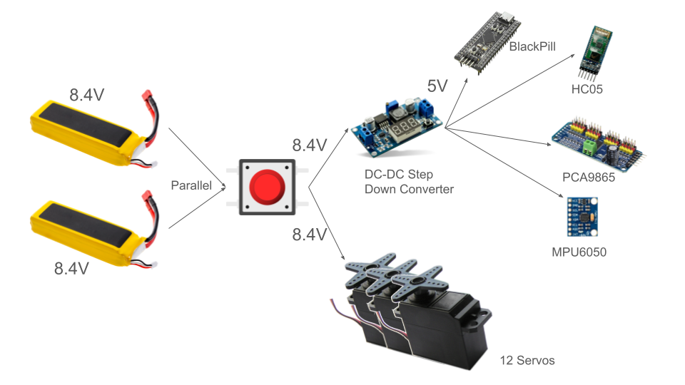
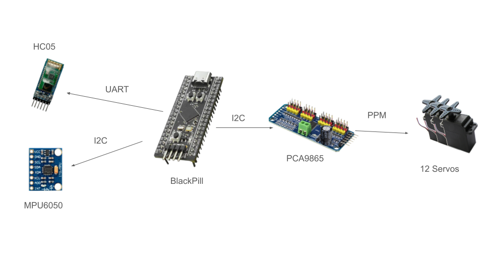

# QR-Wanbot Project

This project demonstrates the use of FreeRTOS on an STM32 microcontroller to manage two main tasks: `MainTask` and `CalcTask`. The `MainTask` is responsible for high-level control, while `CalcTask` handles servo angle calculations and PID control for balancing.

## Project Structure
- **freertos.c**: The main file where the FreeRTOS tasks are created and initialized.
- **main.h**: Header file containing global definitions and includes.
- **main.c**: Initialization code for the STM32 peripherals and FreeRTOS scheduler.
- **PCA9865.c/h**: Code for the servo driver communication.
- **MPU6050.c/h**: Code for the IMU driver communication.
- **spid.c/h**: Code for PID control implementation.

## Tasks Description

### 1. MainTask
- **Purpose**: The `MainTask` is responsible for high-level control logic. It manages the overall system state, handles user inputs, and coordinates between different subsystems.
- **Functionality**:
  - Initializes system components.
  - Reacts to data recieved from the phone app.
  - Decides the each leg's position based on gait cycle.

### 2. CalcTask
- **Purpose**: The `CalcTask` is responsible for calculating the angles for the servos and implementing the PID control algorithm for balancing.
- **Functionality**:
  - Reads sensor data (e.g., IMU) to determine the current orientation.
  - Calculates the required servo angles to maintain balance.
  - Implements the PID control algorithm to adjust the servo positions dynamically.
  - Updates the servo positions based on the calculated values.

## Usage
1. **Power On**: Connect the STM32 to a power source.
2. **Initialize**: The system will initialize the peripherals and start the FreeRTOS scheduler.
3. **Run**: The `MainTask` and `CalcTask` will start executing according to their priorities and scheduling.

## Power Diagram

## Communication Diagram

## Troubleshooting
- **Task Starvation**: Ensure that the priorities of `MainTask` and `CalcTask` are set appropriately to avoid task starvation.
- **Sensor Data**: Verify that the sensor data is being read correctly and is within expected ranges.
- **PID Tuning**: Adjust the PID gains in `CalcFunc` to achieve stable balancing.
- **Step Hieght**: Adjust the Step Hieght in `Freertos.c` to control the height of the step.

## Acknowledgments
- FreeRTOS for providing a robust real-time operating system.
- STMicroelectronics for the STM32 microcontroller and development tools.
