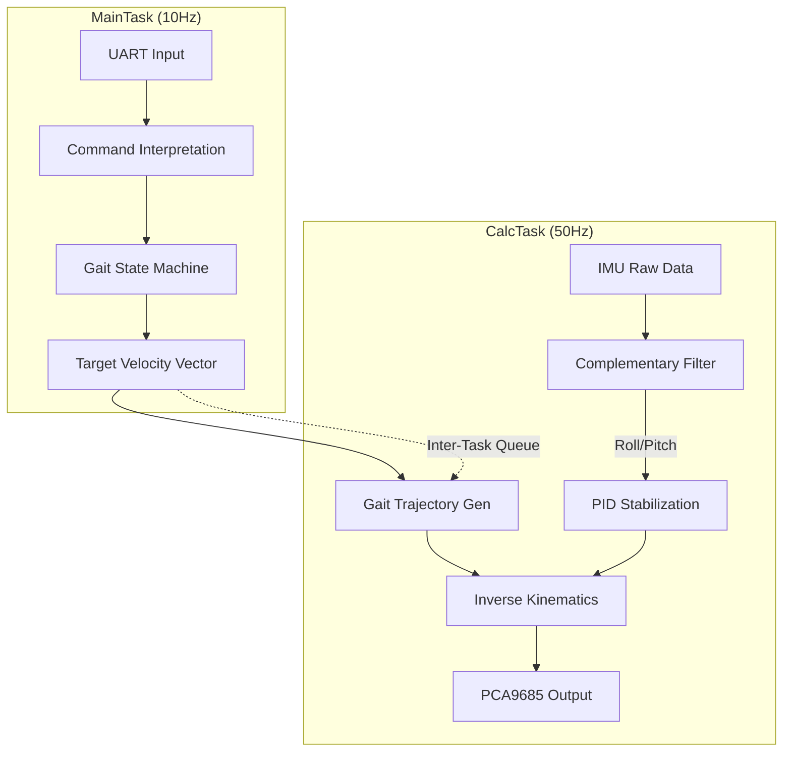
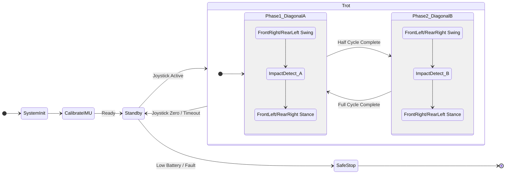

# Figure Diagrams (Mermaid)

## Figure 1: Hardware Architecture
**Caption**: High-level hardware block diagram showing the connections between the STM32 microcontroller, sensors (including FSRs), and actuators.

```mermaid
graph TD
    Power[2S LiPo Battery 8.4V] -->|Power| Servos[12x 9imod HV Servos]
    Power -->|Regulated 5V| MCU[STM32F411RE MCU]
    
    subgraph Sensors
        MCU <-->|I2C 400kHz| IMU[MPU6050 Gyro/Accel]
        MCU <-->|UART| Remote[RC Receiver]
        MCU <-->|ADC Interface| FSR[Pressure Sensors (FSR) x4]
    end
    
    subgraph Actuation
        MCU -->|I2C 1MHz| PCA[PCA9685 PWM Driver]
        PCA -->|PWM Signals| Servos
    end
```

## Figure 2: Software Control Architecture
**Caption**: FreeRTOS task structure separating the high-level gait logic (10Hz) from the real-time kinematic control loop (50Hz).



## Figure 3: Trot Gait Finite State Machine
**Caption**: Detailed operational state machine focusing on the initialization and execution of the Trot gait cycle.


